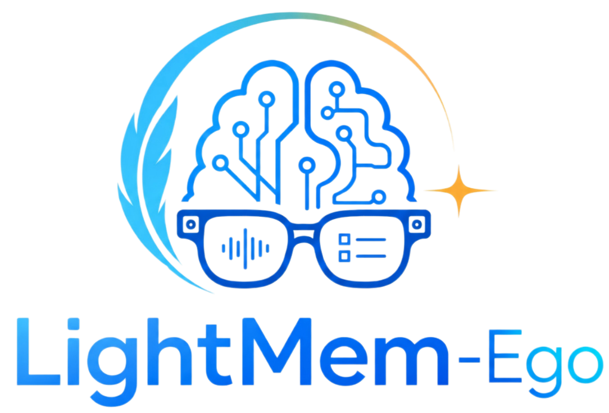
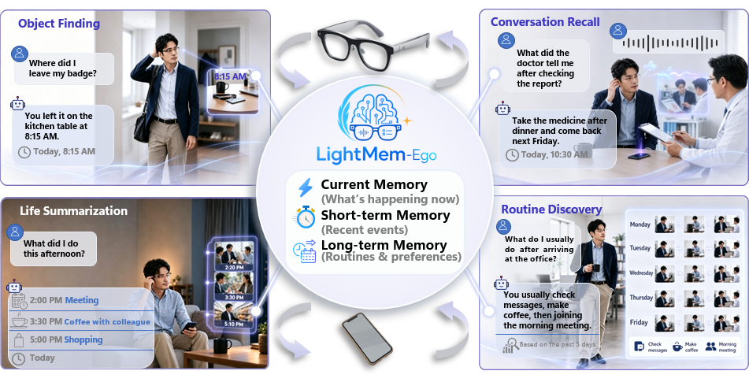
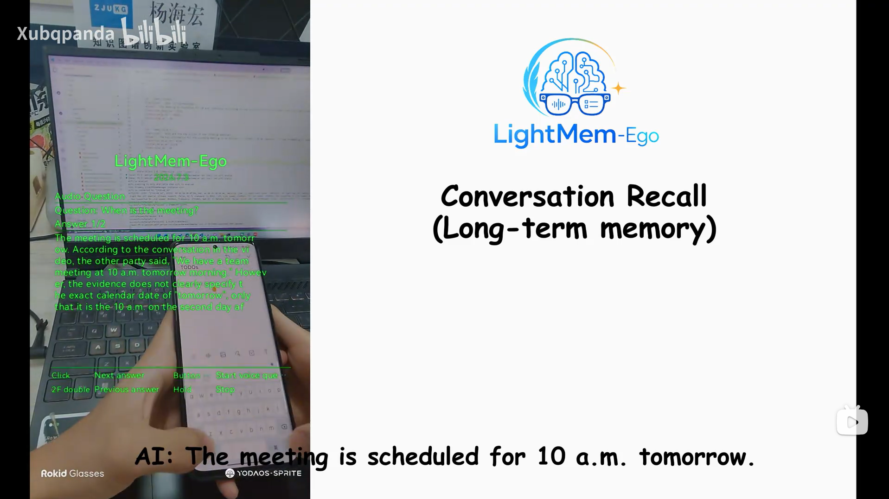

<div align="center">
  
</div>

<h1 align="center">LightMem-Ego: Your AI Memory for Everyday Life</h1>

<p align="center">
  <b>A streaming multimodal memory system for everyday-life assistance on smart glasses and mobile devices.</b>
</p>

<p align="center">
  <a href="#citation">
    
  </a>
  <a href="https://github.com/zjunlp/LightMem-Ego">
    
  </a>
  <a href="https://github.com/zjunlp/LightMem-Ego/blob/main/LICENSE">
    
  </a>
  
  
</p>

<p align="center">
  <a href="#overview">Overview</a> •
  <a href="#demo">Demo</a> •
  <a href="#system-design">System Design</a> •
  <a href="#quick-start">Quick Start</a> •
  <a href="#repository-layout">Repository Layout</a> •
  <a href="#privacy-notice">Privacy</a>
</p>

---

<span id="overview"></span>

## Overview

**LightMem-Ego** is an end-to-end egocentric memory system for everyday-life assistance. It connects a **Rokid AI Glass app**, a **web frontend**, and a **backend service** so that users can stream first-person camera/audio context, build structured memory from daily experience, and ask questions about live or remembered moments.

LightMem-Ego organizes continuous visual-audio experience into a hierarchical memory structure:

- **Current memory** for ongoing scene understanding.
- **Short-term memory** for recent events and conversations.
- **Long-term memory** for consolidated episodes, routines, preferences, and semantic facts.

The system is designed for practical scenarios such as object finding, conversation recall, life summarization, routine discovery, and wearable assistance.

<div align="center">
  
</div>

---

<span id="highlights"></span>

## Highlights

- **Streaming egocentric capture**  
  Captures first-person visual frames and microphone audio from smart glasses.

- **Timeline-aligned multimodal memory**  
  Aligns frames, audio chunks, transcripts, and metadata on a shared session timeline.

- **Hierarchical memory organization**  
  Maintains current, short-term, and long-term memory for different temporal scopes.

- **Memory-grounded question answering**  
  Retrieves timestamped multimodal evidence before generating answers.

- **Glasses + Web deployment**  
  Supports lightweight interaction through a Rokid AI Glass app and a browser frontend.

- **Modular backend**  
  Separates stream ingestion, session management, memory construction, retrieval, and QA.

---

<span id="demo"></span>

## Demo

<p align="center">
  <a href="https://www.bilibili.com/video/BV1oANw62EA3/">
    
  </a>
</p>

<p align="center">
  <a href="https://www.bilibili.com/video/BV1oANw62EA3/">
    ▶ Watch the full demo video
  </a>
</p>

<span id="system-design"></span>

## System Design

LightMem-Ego is organized as three cooperating components:

1. **AI Glass App**  
   Captures first-person camera frames and microphone audio, controls live sessions, submits voice questions, and displays memory-grounded answers on the glasses.

2. **Backend Service**  
   Receives live streams, manages sessions, extracts and stores memory, performs retrieval, and returns answers.

3. **Web Frontend**  
   Provides a browser interface for reviewing sessions, interacting with memory, and using backend-powered QA outside the glasses.

```text
Rokid AI Glass app  ->  Backend API and workers  ->  Memory / Retrieval / QA
                                       ^
                                       |
                                Web frontend
```

At runtime, the glasses app opens a live session with the backend, sends camera/audio data, and receives answers for voice questions. The frontend connects to the same backend service for browser-side interaction and session review.

---

<span id="repository-layout"></span>

## Repository Layout

```text
src/
  frontend/       # Web UI for using and reviewing LightMem-Ego
  backend/        # API service, online workers, and memory-processing logic
  ai_glass_app/   # Rokid AI Glass Android app
```

---

<span id="components"></span>

## Components

### `src/ai_glass_app/`

Android app for Rokid AI Glass.

Current open-source features include:

- Real-time glasses capture session start/stop.
- Camera frame capture from the glasses camera.
- Microphone audio capture from the glasses microphone.
- RTMP live video push when a backend `push_url` is available.
- HTTP frame/audio upload fallback when RTMP is unavailable.
- Voice-question recording and answer display on the glasses UI.

This open-source version does not include local session recording, replay-from-file mode, preset-question UI, or standalone sample screens.

See [`src/ai_glass_app/README.md`](src/ai_glass_app/README.md) for build, install, configuration, controls, and permissions.

### `src/backend/`

Backend service for LightMem-Ego. It is responsible for API endpoints, online session management, stream ingestion, memory processing, retrieval, and answer generation.

See [`src/backend/README.md`](src/backend/README.md) for backend-specific setup and deployment notes.

### `src/frontend/`

Web frontend for LightMem-Ego. It provides the browser interface for interacting with the system, reviewing memory/session content, and using backend-powered QA outside the glasses.

See [`src/frontend/README.md`](src/frontend/README.md) for frontend-specific setup and deployment notes.

---

<span id="quick-start"></span>

## Quick Start

Each subproject has its own setup and runtime requirements. Start with the component README for the part you want to run.

### Build the glasses app

On Windows:

```powershell
cd src\ai_glass_app
.\gradlew.bat assembleDebug
```

On macOS or Linux:

```bash
cd src/ai_glass_app
./gradlew assembleDebug
```

### Configure the backend endpoint

The glasses app API endpoint is configured in:

```text
src/ai_glass_app/app/src/main/java/cn/zjukg/lightmem/glass/worldmm/WorldMMConfig.kt
```

Set `API_BASE_URL` to the backend API address used by your deployment.

---

<span id="scenarios"></span>

## Supported Scenarios

| Scenario | Example Query | Memory Scope |
| :--- | :--- | :--- |
| **Object Finding** | “Where did I leave my badge?” | Current / short-term memory |
| **Conversation Recall** | “What did the doctor tell me after checking the report?” | Short-term memory + transcript context |
| **Life Summarization** | “What did I do this afternoon?” | Short-term and long-term memory |
| **Routine Discovery** | “What do I usually do after arriving at the office?” | Long-term semantic memory |
| **Wearable Assistance** | “What am I looking at now?” | Current memory |

---

<span id="privacy-notice"></span>

## Privacy Notice

LightMem-Ego may process camera frames, microphone audio, transcripts, generated answers, and memory data depending on deployment configuration. Before deploying with real users, review the API endpoint configuration, data retention policy, access control, and user consent flow for your environment.

This repository is intended for research and demonstration. Production deployments should implement privacy-preserving capture, sensitive-content filtering, encrypted storage, access control, retention/deletion policies, and user-controlled memory editing.

---

<span id="license"></span>

## License

See [`LICENSE`](LICENSE).

---

<span id="acknowledgements"></span>

## Acknowledgements

LightMem-Ego builds on the broader line of work on memory-augmented agents, egocentric multimodal understanding, and wearable AI assistants. We thank all contributors and collaborators who helped develop the system.
