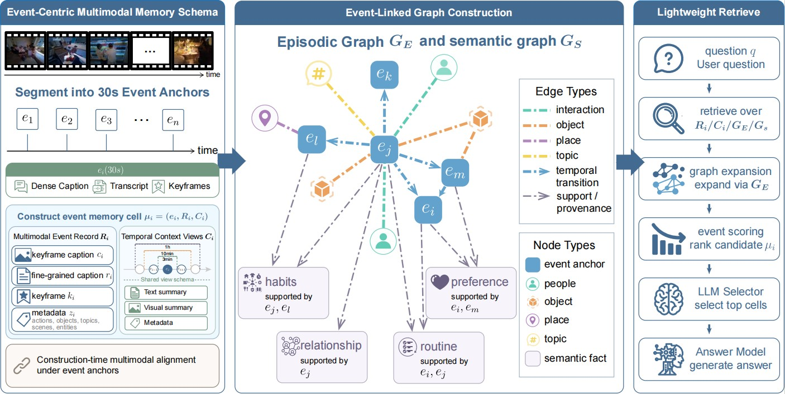

# EM²Mem

### Event-Centric Multimodal Memory for Large Language Models

<p align="center">
  
</p>

<p align="center">
  <a href="https://arxiv.org/abs/2609.00551"></a>
  
  
  <a href="LICENSE"></a>
  <a href="https://drive.google.com/drive/folders/1YZCp8O7Sje-kh3mFpcwnzz19x0tUvELD"></a>
</p>

<p align="center">
  <b>EM²Mem</b> organizes long videos into event-indexed multimodal memory cells, then retrieves a compact, evidence-grounded view for large language models.
</p>

This directory is the **offline research and reproduction implementation** of EM²Mem, maintained inside the [LightMem-Ego](https://github.com/zjunlp/LightMem-Ego) repository. It is intentionally separate from the online glasses runtime. The product backend lives under [`src/backend`](../../src/backend/), while this directory contains dataset preprocessing, memory construction, visual indexing, and benchmark evaluation.

The [Google Drive reproduction artifacts](https://drive.google.com/drive/folders/1YZCp8O7Sje-kh3mFpcwnzz19x0tUvELD) folder contains the artifacts and result files provided for reproduction, including generated outputs and evaluation results. Dataset files and model weights may be subject to their original distribution terms.

> **Snapshot status.** This research snapshot was migrated from EM2Mem commit `13dc3bbefbf2001b046eb5ce02f62bcf8b5da2a0`. The migration does not change the LightMem-Ego backend, frontend, Android app, or deployment stack.

## Why EM²Mem

Long-video QA becomes expensive when every frame, transcript segment, and caption is passed directly to an LLM. EM²Mem uses a shared event anchor to align heterogeneous evidence before retrieval:

- **Event-centric organization** — captions, speech, keyframes, actions, objects, and temporal context are grouped around the same event records.
- **Multiscale episodic memory** — event records are expanded into 30-second, 3-minute, 10-minute, and 1-hour views.
- **Semantic memory** — recurring entities and relations are consolidated into a semantic graph that supports retrieval and evidence expansion.
- **Visual memory** — keyframes and visual embeddings provide an additional evidence channel for visual questions.
- **Evidence-grounded generation** — the selected event evidence is packed into a compact context before answer generation.

## Pipeline

```text
Long video + transcript + captions
                |
                v
       Multimodal event records
                |
       +--------+---------+
       |                  |
       v                  v
  Multiscale          Semantic graph
  episodic memory     and entity links
       |                  |
       +--------+---------+
                |
                v
       Visual memory / embeddings
                |
                v
       Event-level retrieval
                |
                v
       Compact evidence view -> LLM answer
```

## Reported results

The EM²Mem paper reports the following average accuracy on three long-video and egocentric benchmarks:

| Method | EgoLifeQA | Ego-R1 Bench | Video-MME (L) |
| :--- | ---: | ---: | ---: |
| Qwen3-VL-8B | 38.6 | 35.7 | 61.0 |
| Gemini 2.5 Pro | 46.4 | 46.7 | 55.7 |
| GPT-5 | 48.6 | 46.3 | 74.3 |
| VideoChat-Flash | 34.2 | 42.7 | 44.1 |
| Time-R1 | 48.8 | 48.0 | 37.6 |
| Video-RTS | 48.2 | 48.0 | 47.9 |
| LightRAG | 48.8 | 52.3 | 46.6 |
| HippoRAG | 59.6 | 56.0 | 52.1 |
| Video-RAG | 55.4 | 49.7 | 55.4 |
| EgoRAG | 52.0 | 49.0 | 41.1 |
| Ego-R1 | 53.0 | 52.0 | 42.7 |
| HippoMM | 54.6 | 53.0 | 41.6 |
| M3-Agent | 53.5 | 52.0 | 55.3 |
| WorldMM | 65.6 | 65.3 | 76.6 |
| WorldMM† | 64.0 | — | 73.1 |
| **EM²Mem** | **66.0** | **67.7** | **76.8** |

The efficiency comparison below uses the strongest baseline reproduced under the same evaluation setting. See the paper for protocols and implementation details.

| Metric | EM²Mem | WorldMM† | Relative change |
| :--- | ---: | ---: | :---: |
| Average latency per query | **98.21 s** | 459.00 s | **4.67× faster** |
| Wall-clock evaluation time | **6,138 s** | 229,502 s | **37.4× faster** |
| Total tokens | **15.27M** | 42.03M | **63.7% fewer** |

† WorldMM reproduced under the same evaluation setting.

<details>
<summary><b>Full per-category results</b> — all reported benchmark categories</summary>

**EgoLifeQA** — Ent. / EvR. / Hab. / Rel. / Task.

| Method | Ent. | EvR. | Hab. | Rel. | Task | Avg. |
| :--- | ---: | ---: | ---: | ---: | ---: | ---: |
| Qwen3-VL-8B | 35.2 | 30.2 | 39.3 | 46.4 | 46.0 | 38.6 |
| Gemini 2.5 Pro | 43.2 | 40.5 | 41.0 | 55.2 | 52.4 | 46.4 |
| GPT-5 | 47.2 | 42.1 | 47.5 | 53.6 | 55.6 | 48.6 |
| VideoChat-Flash | 28.8 | 32.5 | 37.7 | 37.6 | 38.1 | 34.2 |
| Time-R1 | 39.2 | 50.8 | 65.6 | 48.8 | 47.6 | 48.8 |
| Video-RTS | 40.8 | 48.4 | 62.3 | 48.8 | 47.6 | 48.2 |
| LightRAG | 40.8 | 48.4 | 67.2 | 50.4 | 44.4 | 48.8 |
| HippoRAG | 48.8 | 60.3 | 70.5 | 60.8 | 66.7 | 59.6 |
| Video-RAG | 49.6 | 56.3 | 67.2 | 55.2 | 54.0 | 55.4 |
| EgoRAG | 40.0 | 56.3 | 62.3 | 54.4 | 52.4 | 52.0 |
| Ego-R1 | 51.2 | 53.2 | 63.9 | 50.4 | 50.8 | 53.0 |
| HippoMM | 45.6 | 53.2 | 70.5 | 55.2 | 58.7 | 54.6 |
| M3-Agent | 44.4 | 54.8 | 62.3 | 56.8 | 54.0 | 53.5 |
| WorldMM | 62.4 | 64.3 | 75.4 | 62.4 | 71.4 | 65.6 |
| WorldMM† | 57.6 | 65.1 | 68.9 | 68.8 | 60.3 | 64.0 |
| **EM²Mem** | **60.8** | 61.1 | 63.9 | **72.8** | **74.6** | **66.0** |

**Ego-R1 Bench** — Ent. / EvR. / Hab. / Rel. / Task.

| Method | Ent. | EvR. | Hab. | Rel. | Task | Avg. |
| :--- | ---: | ---: | ---: | ---: | ---: | ---: |
| Qwen3-VL-8B | 31.8 | 41.5 | 38.5 | 42.1 | 44.7 | 35.7 |
| Gemini 2.5 Pro | 43.9 | 56.1 | 53.9 | 47.4 | 47.4 | 46.7 |
| GPT-5 | 41.8 | 58.5 | 53.9 | 52.6 | 50.0 | 46.3 |
| VideoChat-Flash | 43.4 | 43.9 | 38.5 | 31.6 | 44.7 | 42.7 |
| Time-R1 | 49.2 | 48.8 | 46.2 | 42.1 | 44.7 | 48.0 |
| Video-RTS | 47.6 | 46.3 | 53.9 | 52.6 | 47.4 | 48.0 |
| LightRAG | 54.0 | 61.0 | 46.2 | 42.1 | 42.1 | 52.3 |
| HippoRAG | 54.5 | 65.9 | 69.2 | 52.6 | 50.0 | 56.0 |
| Video-RAG | 48.7 | 58.5 | 53.9 | 47.4 | 44.7 | 49.7 |
| EgoRAG | 46.6 | 56.1 | 46.2 | 47.4 | 55.3 | 49.0 |
| Ego-R1 | 50.8 | 63.4 | 38.5 | 36.8 | 57.9 | 52.0 |
| HippoMM | 51.9 | 56.1 | 46.2 | 52.6 | 57.9 | 53.0 |
| M3-Agent | 52.4 | 58.5 | 38.5 | 42.1 | 52.6 | 52.0 |
| WorldMM | 64.6 | 70.7 | 76.9 | 57.9 | 63.2 | 65.3 |
| **EM²Mem** | **74.6** | 53.7 | 69.2 | 47.4 | 57.9 | **67.7** |

**Video-MME (L)**

| Method | ARES | AREC | ATTR | CNT | ISYN | OCR | ORES | OREC | SPER | SRES | TPER | TRES | Avg. |
| :--- | ---: | ---: | ---: | ---: | ---: | ---: | ---: | ---: | ---: | ---: | ---: | ---: | ---: |
| Qwen3-VL-8B | 62.2 | 54.0 | 51.9 | 43.8 | 68.1 | 42.9 | 62.9 | 57.4 | 33.3 | 45.5 | 33.3 | 67.0 | 61.0 |
| Gemini 2.5 Pro | 56.9 | 47.6 | 66.7 | 41.7 | 71.8 | 57.1 | 53.3 | 40.7 | 0.0 | 72.7 | 66.7 | 48.4 | 55.7 |
| GPT-5 | 71.1 | 69.8 | 70.4 | 47.9 | 88.3 | 57.1 | 75.8 | 74.1 | 33.3 | 72.7 | 50.0 | 75.8 | 74.3 |
| VideoChat-Flash | 35.0 | 42.9 | 37.0 | 31.3 | 34.4 | 42.9 | 60.0 | 46.3 | 33.3 | 54.5 | 33.3 | 46.2 | 44.1 |
| Time-R1 | 20.6 | 28.6 | 25.9 | 35.4 | 31.9 | 35.7 | 53.3 | 48.2 | 33.3 | 36.4 | 50.0 | 44.0 | 37.6 |
| Video-RTS | 43.3 | 52.4 | 40.7 | 39.6 | 33.7 | 42.9 | 60.8 | 53.7 | 33.3 | 45.5 | 50.0 | 49.5 | 47.9 |
| LightRAG | 41.7 | 30.2 | 40.7 | 35.4 | 54.0 | 50.0 | 46.7 | 61.1 | 33.3 | 45.5 | 50.0 | 52.8 | 46.6 |
| HippoRAG | 45.6 | 47.6 | 40.7 | 37.5 | 52.2 | 42.9 | 52.9 | 64.8 | 66.7 | 54.5 | 50.0 | 70.3 | 52.1 |
| Video-RAG | 51.7 | 47.6 | 37.0 | 39.6 | 49.7 | 57.1 | 62.1 | 68.5 | 66.7 | 45.5 | 50.0 | 68.1 | 55.4 |
| EgoRAG | 31.1 | 55.6 | 33.3 | 22.9 | 41.1 | 28.6 | 44.6 | 48.2 | 33.3 | 54.5 | 66.7 | 48.4 | 41.1 |
| Ego-R1 | 37.2 | 52.4 | 40.7 | 35.4 | 38.0 | 35.7 | 42.1 | 51.9 | 66.7 | 63.6 | 50.0 | 52.8 | 42.7 |
| HippoMM | 41.1 | 42.9 | 55.6 | 35.4 | 38.7 | 35.7 | 37.9 | 53.7 | 33.3 | 54.5 | 50.0 | 47.3 | 41.6 |
| M3-Agent | 52.2 | 57.1 | 59.3 | 45.8 | 51.5 | 42.9 | 54.6 | 64.8 | 33.3 | 45.5 | 50.0 | 71.4 | 55.3 |
| WorldMM | 81.1 | 73.0 | 70.4 | 54.2 | 85.3 | 42.9 | 75.0 | 77.8 | 33.3 | 72.7 | 66.7 | 79.1 | 76.6 |
| WorldMM† | 73.3 | 68.3 | 77.8 | 60.4 | 80.2 | 50.0 | 72.4 | 77.8 | 33.3 | 90.9 | 66.7 | 71.1 | 73.1 |
| **EM²Mem** | 77.2 | **76.2** | **77.8** | **64.6** | 80.7 | **64.3** | **77.0** | **77.8** | **33.3** | 81.8 | 50.0 | **79.1** | **76.8** |

† `WorldMM` denotes the reproduced setting reported in the paper.

</details>

## Quick start

### Requirements

- Linux with Python 3.10 or newer
- `uv`
- CUDA-capable GPU for the default visual and embedding pipeline
- An OpenAI-compatible LLM endpoint for captioning, graph construction, and answer generation
- `ffmpeg`/video decoding support for the selected dataset

The research environment is separate from the LightMem-Ego backend environment. Run all commands from this directory:

```bash
cd LightMem-Ego/research/em2mem
```

Set the LLM credentials before running the pipeline:

```bash
export OPENAI_API_KEY="your-api-key"
export OPENAI_BASE_URL="https://api.openai.com/v1"  # optional
export OPENAI_MODEL="gpt-5-mini"                     # optional
```

Run the setup script for EgoLife:

```bash
bash script/1_setup.sh
```

This creates the local `uv` environment and downloads the dataset into `data/EgoLife/`. For Video-MME, use the dedicated setup script:

```bash
bash script/videomme/1_setup.sh
```

> Dataset files, model weights, generated metadata, and logs are intentionally not included in this repository. The setup scripts download them into Git-ignored directories.

## Reproduce the pipeline

### EgoLife

The default example uses participant `A1_JAKE`. Each stage can be rerun independently after its inputs are available.

```bash
# 1. Translate captions and build synchronized transcript records
bash script/2_preprocess.sh

# 2. Build event records and multiscale episodic memory
bash script/3_build_multimodal_memory_cell.sh \
  --person A1_JAKE \
  --model gpt-5-mini

# 3. Extract and consolidate semantic memory
bash script/4_build_semantic_graph.sh \
  --person A1_JAKE \
  --model gpt-5-mini

# 4. Run benchmark evaluation
bash script/6_eval.sh \
  --person A1_JAKE \
  --retriever-model gpt-5-mini \
  --respond-model gpt-5 \
  --gpu-list 0
```

Generated records and indexes are written under `output/metadata/`, and run logs are written under `.log/`.

### Optional visual retrieval

The reported EM²Mem benchmark results use the event, semantic, and episodic memory pipeline above. Visual feature extraction is an optional extension for experiments that need frame-level visual retrieval; it is not required for the standard evaluation flow:

```bash
bash script/5_extract_visual_features.sh \
  --person A1_JAKE \
  --gpu 0 \
  --num_frames 16
```

### Video-MME

The Video-MME scripts follow the same stages and accept dataset-specific options such as duration, GPU list, and model names:

```bash
bash script/videomme/1_setup.sh --duration long
bash script/videomme/2_preprocess.sh
bash script/videomme/3_build_mulmodal_memory_cell.sh
bash script/videomme/4_build_semantic_graph.sh
bash script/videomme/6_eval.sh --duration long --gpu-list 0
```

For large runs, distribute visual extraction and evaluation across multiple GPUs with comma-separated GPU IDs, for example `--gpu-list 0,1,2`.

If a Video-MME experiment needs frame-level visual retrieval, run the optional visual extraction stage before evaluation:

```bash
bash script/videomme/5_extract_visual_features.sh --gpu-list 0
```

## Repository layout

```text
research/em2mem/
├── src/em2mem/                  # EM²Mem memory, embedding, and LLM modules
├── preprocess/                  # Event records, temporal views, graphs, and visual memory
├── eval/                        # EgoLife and Video-MME evaluation entry points
├── script/                      # End-to-end setup, preprocessing, and evaluation scripts
├── data/                        # Dataset utilities; downloaded data is not committed
├── assets/                      # Documentation figures
├── pyproject.toml               # Reproducible research dependencies
├── uv.lock                      # Locked environment resolution
└── LICENSE                      # ZJUNLP MIT license
```

## Research and product implementations

The two EM²Mem directories serve different purposes:

| Location | Role |
| :--- | :--- |
| `research/em2mem/` | Offline experiments, paper reproduction, preprocessing, and benchmark evaluation |
| `src/backend/src/em2mem/` | Online runtime implementation used by LightMem-Ego's memory workers and query service |

They are not currently a single importable package. Do not add `research/em2mem/src` to the production backend `PYTHONPATH`; this prevents research dependencies and runtime behavior from being mixed accidentally.

## Citation

If you use EM²Mem, please cite:

```bibtex
@article{chen2026em2mem,
  title={EM$^{2}$Mem: Event-Centric Multimodal Memory for Large Language Models},
  author={Chen, Yijun and Zheng, Yaqi and Li, Yanya and Xiao, Boyi and Xu, Buqiang and Qiao, Shuofei and Fang, Jizhan and Deng, Xinle and Yao, Yunzhi and Wang, Xuehai and others},
  journal={arXiv preprint arXiv:2609.00551},
  year={2026}
}
```

When using the complete LightMem-Ego system, please also cite the [LightMem-Ego paper](https://arxiv.org/abs/2607.11487).

## License and acknowledgements

EM²Mem is released under the [MIT License](LICENSE) as part of the ZJUNLP LightMem-Ego project. The repository includes components derived from other open-source projects; retain their notices and consult the bundled licenses before redistribution. The visual embedding implementation includes its own upstream Apache license at [`src/em2mem/embedding/VLM2Vec/LICENSE`](src/em2mem/embedding/VLM2Vec/LICENSE).
