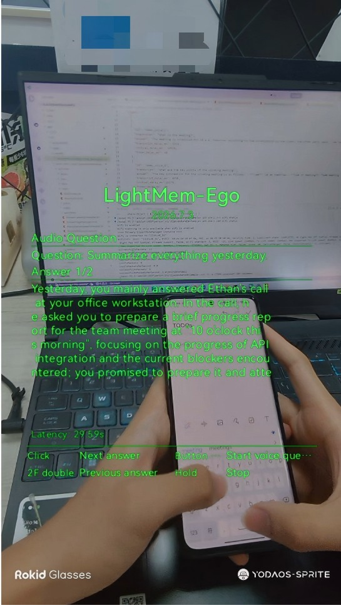
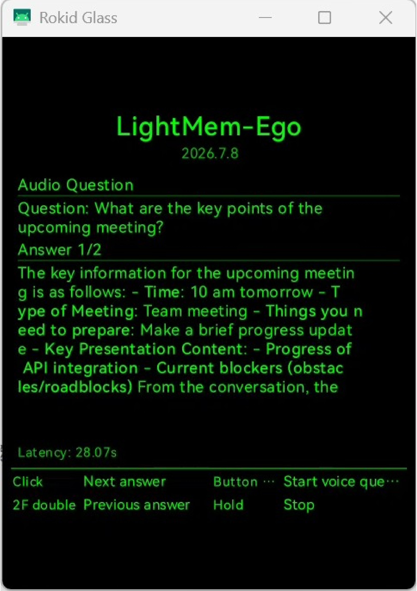

# LightMem-Ego Glass App

This directory contains the Rokid AI Glass Android client for LightMem-Ego. The app is the wearable interface for hands-free capture and question answering.

The app captures camera frames and microphone audio from the glasses, sends the live stream to a configured LightMem-Ego backend service, records short voice questions, and displays memory-grounded answers on the glasses screen.

The app uses standard Android APIs, Jetpack Compose UI, CameraX frame capture, `AudioRecord` microphone capture, RootEncoder RTMP streaming, and Rokid touchpad / button input. It does not require a phone-side SDK at runtime.

## Demonstration

- User perspective

  

- Glasses app UI

  

## Features

- Start and stop a real-time glasses capture session.
- Capture camera frames from the glasses camera.
- Capture microphone audio from the glasses microphone.
- Push live video through RTMP when a `push_url` is available.
- Fall back to HTTP frame/audio upload when RTMP is unavailable.
- Ask short voice questions from the glasses.
- Show answers on a 480 x 640 high-contrast glasses UI.

This open-source version does not include local session recording, replay-from-file mode, preset-question UI, or standalone photo/video/audio/IMU sample screens.

## Project Layout

```text
src/ai_glass_app/
  app/src/main/java/cn/zjukg/lightmem/glass/
    activities/main/            # Android entry activity
    activities/lightmem_ego/    # Glasses UI and session state
    camera/                     # CameraX binding helper
    input/                      # Rokid key and touchpad input dispatcher
    ui/design/                  # Glasses-oriented UI components
    ui/theme/                   # Compose theme
    lightmem_ego/               # API client, RTMP streamer, audio/image helpers
  app/src/main/AndroidManifest.xml
  gradle/libs.versions.toml
```

## Requirements

- Rokid AI Glass running Android 12 API 31 or later.
- Android Studio or Android SDK command-line tools.
- JDK compatible with the Android Gradle Plugin used by this project.
- ADB access to the glasses.
- A reachable LightMem-Ego backend API.

Project settings:

- `minSdk = 31`
- `targetSdk = 36`
- application id: `cn.zjukg.lightmem.glass`

## Configure

Edit:

```text
app/src/main/java/cn/zjukg/lightmem/glass/lightmem_ego/LightMemEgoConfig.kt
```

Important values:

```kotlin
const val API_BASE_URL = "https://lightmem-ego.zjukg.cn/api"
const val INPUT_MODE = "rokid_live_rtmp"
const val FALLBACK_INPUT_MODE = "rokid_frame_audio"
const val CREATE_NEW_PARENT_SESSION = true
const val PARENT_SESSION_ID = ""
```

Change `API_BASE_URL` before building if you want the app to connect to a different backend service.

`INPUT_MODE` asks the backend for a live RTMP push URL. `FALLBACK_INPUT_MODE` is used when the app needs to upload frames and audio directly over HTTP.

## Build

Run commands from the `src/ai_glass_app/` directory.

Windows:

```powershell
.\gradlew.bat assembleDebug
```

macOS or Linux:

```bash
./gradlew assembleDebug
```

The debug APK is generated at:

```text
app/build/outputs/apk/debug/app-debug.apk
```

Release builds are signed with the local keystore configured through ignored local properties:

```properties
LIGHTMEM_RELEASE_STORE_FILE=lightmem-ego-release.jks
LIGHTMEM_RELEASE_STORE_PASSWORD=...
LIGHTMEM_RELEASE_KEY_ALIAS=lightmem-ego-release
LIGHTMEM_RELEASE_KEY_PASSWORD=...
```

The release APK is generated with:

```powershell
.\gradlew.bat assembleRelease
```

Output path:

```text
app/build/outputs/apk/release/app-release.apk
```

Keep `lightmem-ego-release.jks` and the release signing values private. Android uses this signing certificate to decide whether a future APK is allowed to upgrade an installed app.

## Install And Start

1. Enable ADB for the Rokid AI Glass.
2. Check that the device is visible:

```bash
adb devices
```

3. Install the APK:

```bash
adb install -r app/build/outputs/apk/release/app-release.apk
```

4. Start the app from the glasses launcher, or start it with ADB:

```bash
adb shell monkey -p cn.zjukg.lightmem.glass 1
```

5. Watch logs if needed:

```bash
adb logcat | grep LightMemEgoDiag
```

On Windows PowerShell:

```powershell
adb logcat | findstr LightMemEgoDiag
```

## Controls

The glasses app uses two input surfaces:

- TouchPad: the touch area on the glasses. It supports one-finger click, one-finger double click, one-finger long press, and two-finger long press.
- Physical temple button: the hardware button on the glasses temple. Click this button for voice-question recording.

App actions:

- TouchPad one-finger long press: start or stop the real-time capture session.
- TouchPad one-finger click / Enter key while running: ask the currently selected preset question.
- TouchPad one-finger double click / Back key: select the next preset question. The app consumes this action, so it does not exit.
- Physical temple button click while running: start recording a voice question. Click the physical temple button again to stop recording and submit it.
- TouchPad two-finger long press: show the next answer page when an answer has multiple pages.
- TouchPad two-finger click, TouchPad two-finger double click, TouchPad swipes, and repeated long-press events: consumed by the app to avoid accidental system actions.

## Permissions

The app declares only the permissions needed by the glasses-side real-time flow:

```xml
<uses-permission android:name="android.permission.CAMERA" />
<uses-permission android:name="android.permission.INTERNET" />
<uses-permission android:name="android.permission.RECORD_AUDIO" />
```

- `CAMERA`: captures frames from the glasses camera.
- `RECORD_AUDIO`: captures microphone audio and voice questions.
- `INTERNET`: sends data to the configured backend service.

No external-storage permission is required. Android automatic backup is disabled with `android:allowBackup="false"`.

## Privacy

When a capture session is running, the app captures camera frames and microphone audio and sends them to the configured backend service. The current open-source version does not save local session recordings.

## Test

Run unit tests from the `src/ai_glass_app/` directory:

```powershell
.\gradlew.bat testDebugUnitTest
```

Build a debug APK:

```powershell
.\gradlew.bat assembleDebug
```

Build a signed release APK:

```powershell
.\gradlew.bat assembleRelease
```
