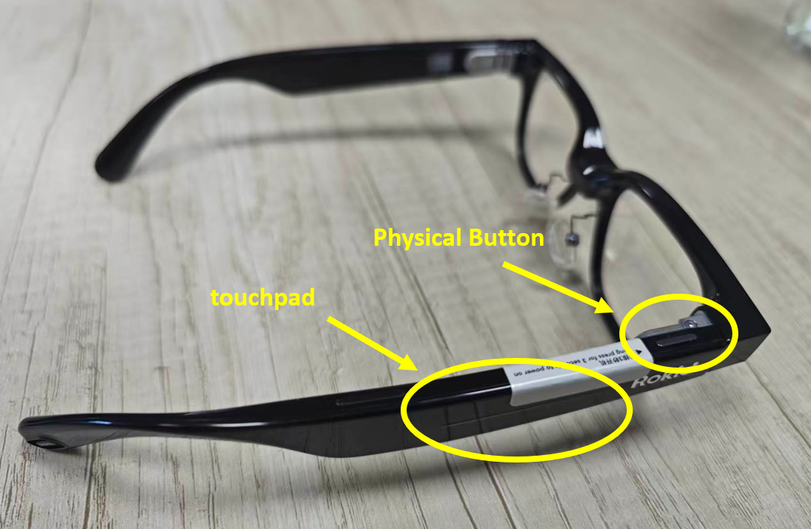
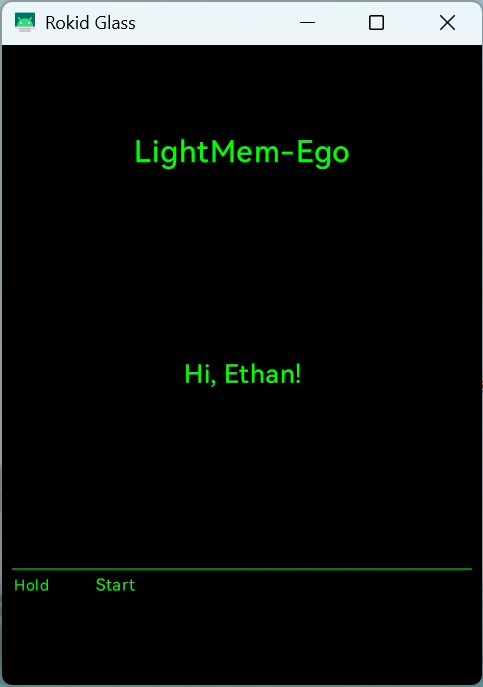
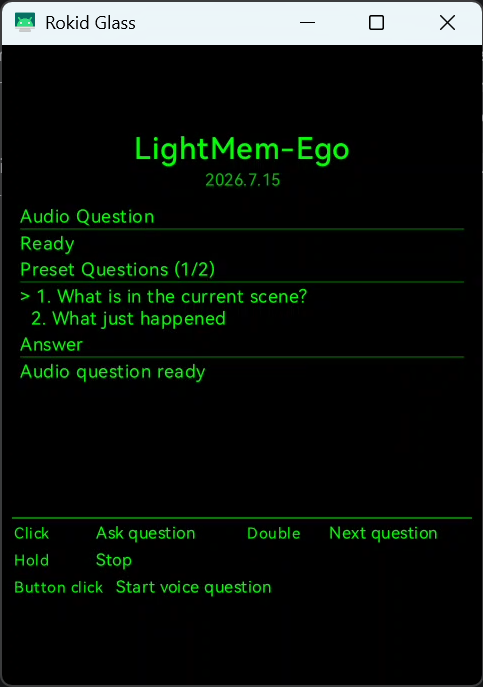
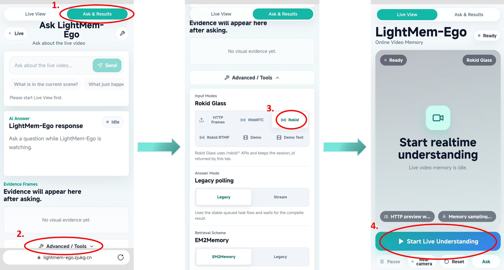

# LightMem-Ego App on Rokid AI Glasses

This directory contains the app running on Rokid AI Glass for LightMem-Ego. The app serves as the wearable interface for the personal AI assistant, which demonstrates the application scenarios of AI at the edge.

The app captures camera frames and microphone audio from the glasses, uploads them to a configured LightMem-Ego backend service over HTTP, and generates memories accordingly. Users can select preset questions or record audio questions to ask. The app will display memory-grounded answers on the glasses screen. Alternatively, if it's not convenient to ask questions by speaking, we can connect the active session of glass on the [web page](https://lightmem-ego.zjukg.cn/) and ask questions by typing.

The app uses standard Android APIs, Jetpack Compose UI, CameraX frame capture, `AudioRecord` microphone capture, HTTP multipart upload, and Rokid touchpad / button input. It does not require a phone-side SDK at runtime.

## Demonstration

- User perspective

  

- Glasses app UI

  

## Usage

We have released the APK file of the app. You can 

## Project Layout

```text
src/ai_glass_app/
  app/src/main/java/cn/zjukg/lightmem/glass/
    activities/main/            # Android entry activity
    activities/lightmem_ego/    # Glasses UI and session state
    camera/                     # CameraX binding helper
    input/                      # Rokid key and touchpad input dispatcher
    ui/design/                  # Glasses-oriented UI components
    ui/theme/                   # Compose theme
    lightmem_ego/               # API client, audio/image helpers
  app/src/main/AndroidManifest.xml
  gradle/libs.versions.toml
```

## Requirements

- Rokid AI Glass.
- Android Studio or Android SDK command-line tools.
- JDK compatible with the Android Gradle Plugin used by this project.
- ADB access to the glasses.
- A reachable LightMem-Ego backend API.

## Install

1. Enable ADB for the Rokid AI Glass.
2. Check that the device is visible:

```bash
adb devices
```

3. Install the APK:

```bash
adb install -r path_to_APK
```

## Use

Start the app from the glasses launcher, or start it with ADB:

```bash
adb shell monkey -p cn.zjukg.lightmem.glass 1
```

The Rokid AI Glasses have two control areas: a **touchpad** on the side of the temple arm and a **physical button** near the front of the temple arm.



After launching the app, you will first see the welcome screen.



Press and hold the touchpad to enter the interface shown below and start recording your experiences and asking questions. 


When the small text below the **“LightMem-Ego”** title displays a specific number of days, the app has successfully connected to the backend server. Once the Answer section is ready, you can start asking questions.



This app supports two ways to ask questions:

- Double click the **touchpad** to change the preset questions, then click to ask the selected questions. You can change the preset questions in `.\src\ai_glass_app\app\src\main\java\cn\zjukg\lightmem\glass\lightmem_ego\LightMemEgoConfig.kt: 8-13`.
- Push the **physical button** to start a voice question. After speaking questions, push the button again to end the voice question.

If it's inconvenient to speak, you can ask on the web page as well. Just select "**Rokid**" mode (not "Rokid RTMP", which is for testing some functions) and start, then it will automatically connect to the same session on glass:



In order to facilitate everyone's reference, we list all the supported operations here:

The glasses app uses two input surfaces:

- TouchPad: the touch area on the glasses. It supports one-finger click, one-finger double click, one-finger long press, and two-finger long press.
- Physical temple button: the hardware button on the glasses temple. Click this button for voice-question recording.

App actions:

- TouchPad one-finger long press: start or stop the real-time capture session.
- TouchPad one-finger click while running: ask the currently selected preset question.
- TouchPad one-finger double click: select the next preset question.
- TouchPad two-finger long press: show the next answer page when an answer has multiple pages.
- Physical temple button click while running: start recording a voice question. Click the physical temple button again to stop recording and submit it.

## Permissions

The app declares only the permissions needed by the glasses-side real-time flow:

```xml
<uses-permission android:name="android.permission.CAMERA" />
<uses-permission android:name="android.permission.INTERNET" />
<uses-permission android:name="android.permission.RECORD_AUDIO" />
```

- `CAMERA`: captures frames from the glasses camera.
- `RECORD_AUDIO`: captures microphone audio and voice questions.
- `INTERNET`: sends data to the configured backend service.

No external-storage permission is required. Android automatic backup is disabled with `android:allowBackup="false"`.
